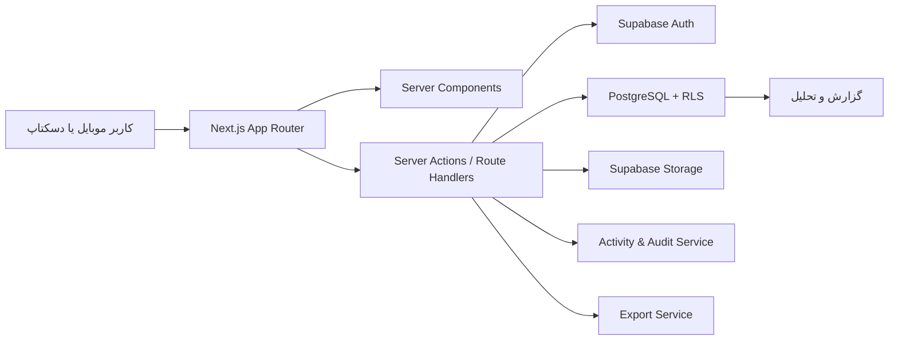
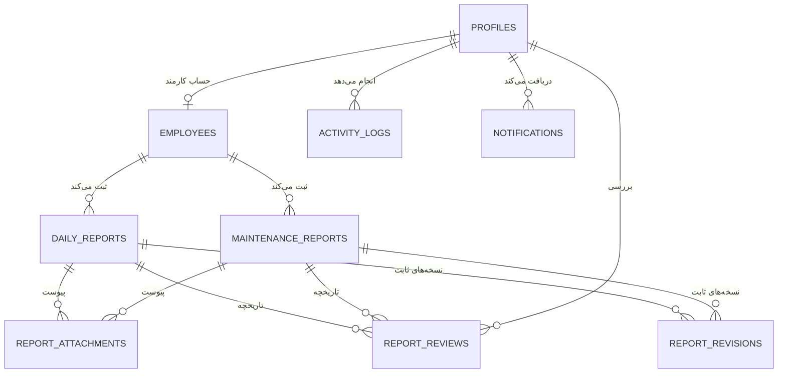
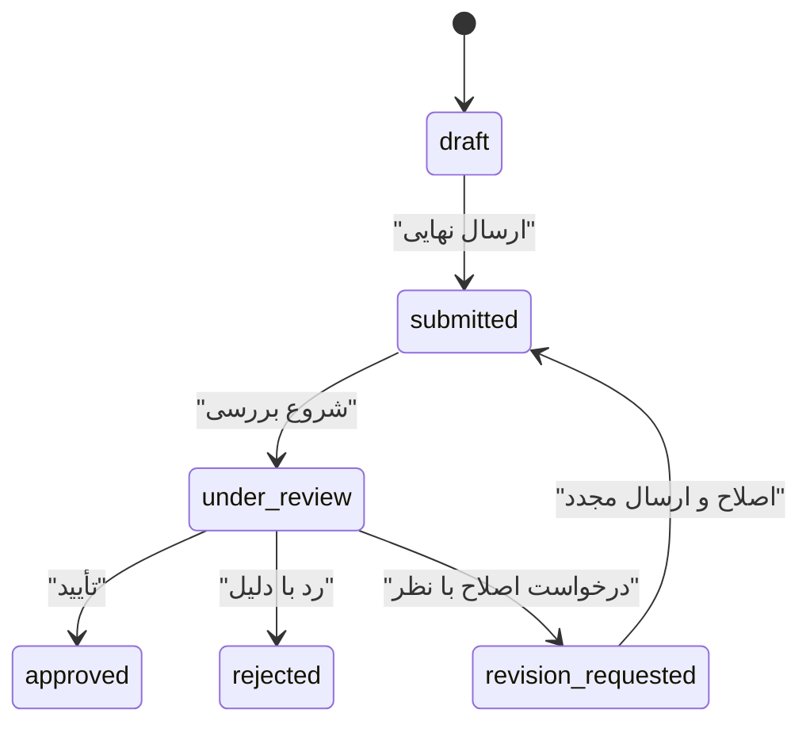

# معماری نسخهٔ ۱ سامانه مدیریت عملیات فارم

> وضعیت: پیشنهاد فنی فاز ۱ — آمادهٔ تأیید پیش از شروع پیاده‌سازی
>
> دامنهٔ نسخهٔ ۱ فقط شامل گزارش روزانه، تعمیرات و سرویس، کارکنان، بررسی مدیریتی، گزارش‌گیری و ثبت فعالیت است. موجودی ماینر، تله‌متری، هش‌ریت، دما، مالکیت دستگاه، QR، هشدار سخت‌افزاری و Whatsminer API عمداً خارج از دامنه‌اند.

## ۱. معماری سیستم

### تصمیم اصلی

یک **modular monolith** با Next.js App Router و Supabase ساخته می‌شود. این انتخاب برای نسخهٔ نخست، پیچیدگی عملیاتی را پایین نگه می‌دارد اما مرزهای دامنه‌ای آن‌قدر روشن هستند که قابلیت‌های دستگاه در نسخهٔ ۲ به‌صورت ماژول مستقل اضافه شوند.



### لایه‌ها

1. **Presentation**: صفحه‌ها، کامپوننت‌ها، فرم‌های مرحله‌ای و تجربهٔ اختصاصی موبایل/دسکتاپ.
2. **Application**: use caseهای ثبت، ارسال، بررسی، درخواست اصلاح، تأیید، رد، فیلتر و خروجی.
3. **Domain**: انواع، وضعیت‌ها، قوانین انتقال وضعیت، مجوزها و validation مستقل از UI.
4. **Infrastructure**: Supabase Auth، PostgreSQL، Storage، ثبت رخداد و تولید خروجی.

### انتخاب‌های فنی

- Next.js آخرین نسخهٔ پایدار، TypeScript با strict mode و App Router
- Tailwind CSS و shadcn/ui به‌عنوان primitive؛ ظاهر نهایی با tokenهای اختصاصی و بدون نمای پیش‌فرض shadcn
- Supabase برای PostgreSQL، Auth، Storage و Row Level Security
- React Hook Form + Zod برای فرم و validation مشترک کلاینت/سرور
- Recharts برای نمودارهای مدیریتی با بارگذاری lazy
- `Intl.DateTimeFormat('fa-IR-u-ca-persian')` برای نمایش جلالی؛ ذخیرهٔ تاریخ‌ها با `date` و زمان‌ها با `timestamptz` در UTC
- فونت Vazirmatn به‌صورت self-hosted برای پایداری و سرعت
- اعداد نمایشی فارسی، ولی ورودی‌های عددی پیش از validation به رقم لاتین normalize می‌شوند
- Server Components برای خواندن داده؛ Server Actions یا Route Handlers فقط برای mutation و upload/export
- TanStack Query فقط در صورت نیاز واقعی به state تعاملی پیچیده؛ دادهٔ اولیه از سرور می‌آید

### اصول امنیت و پایداری

- هر جدول عملیاتی RLS دارد؛ اعتبارسنجی نقش فقط در رابط کاربری کافی محسوب نمی‌شود.
- نقش از پروفایل سروری خوانده می‌شود و قابل اعتمادسازی از metadata قابل‌ویرایش کاربر نیست.
- Service-role key هرگز به مرورگر نمی‌رسد.
- فایل‌ها در bucket خصوصی نگهداری و با signed URL کوتاه‌عمر نمایش داده می‌شوند.
- نوع، اندازه و تعداد فایل در کلاینت و سرور بررسی می‌شود؛ نام فایل تصادفی است.
- mutationها دارای بررسی مجوز، schema validation و ثبت activity هستند.
- حذف گزارش به‌صورت soft delete است؛ حذف فیزیکی فقط در فرآیند نگهداری ادمین.
- رکوردهای review و activity append-only هستند.
- هزینه با `numeric(14,0)` و واحد پول در تنظیمات سیستم ذخیره می‌شود، نه با float.
- تمام queryهای فهرست صفحه‌بندی‌شده‌اند و فیلترها در URL قرار می‌گیرند.

### مرز نسخهٔ ۲

ماژول آیندهٔ `assets` مالک موجودی و مشخصات دستگاه خواهد بود. در نسخهٔ ۱، `maintenance_reports.equipment_identifier` متن آزاد است. بعداً یک `asset_id` nullable به آن اضافه می‌شود، بدون حذف متن تاریخی یا تغییر گردش‌کار تعمیرات. تله‌متری و API سخت‌افزار در schema و service جدا قرار می‌گیرند و به جدول گزارش‌ها تحمیل نمی‌شوند.

---

## ۲. نقشهٔ سایت

همهٔ مسیرهای داخل `(app)` نیازمند ورود هستند. دسترسی نهایی در سرور و RLS کنترل می‌شود.

| مسیر | کارمند | مدیر | ادمین | توضیح |
|---|:---:|:---:|:---:|---|
| `/login` | عمومی | عمومی | عمومی | ورود با موبایل/ایمیل و رمز |
| `/dashboard` | ✓ | ✓ | ✓ | داشبورد متناسب با نقش |
| `/daily-reports` | فقط خود | همه | همه | فهرست گزارش‌های روزانه |
| `/daily-reports/new` | ✓ | ✓ | ✓ | فرم چهارمرحله‌ای |
| `/daily-reports/[id]` | فقط خود | همه | همه | جزئیات و تاریخچهٔ بررسی |
| `/daily-reports/[id]/edit` | پیش‌نویس/اصلاح خود | طبق مجوز | ✓ | ویرایش کنترل‌شده |
| `/maintenance` | فقط خود | همه | همه | فهرست تعمیرات و سرویس |
| `/maintenance/new` | ✓ | ✓ | ✓ | فرم مرحله‌ای تعمیرات |
| `/maintenance/[id]` | فقط خود | همه | همه | جزئیات و گردش بررسی |
| `/maintenance/[id]/edit` | پیش‌نویس/اصلاح خود | طبق مجوز | ✓ | ویرایش کنترل‌شده |
| `/employees` | — | ✓ | ✓ | فهرست کارکنان؛ مدیریت برای ادمین |
| `/employees/[id]` | — | ✓ | ✓ | پروفایل و تب‌های فعالیت |
| `/reports` | — | ✓ | ✓ | تحلیل، فیلتر و خروجی |
| `/activity` | — | محدود | ✓ | فعالیت‌های سازمان؛ audit کامل برای ادمین |
| `/notifications` | ✓ | ✓ | ✓ | اعلان‌های داخل سامانه |
| `/settings` | پروفایل خود | پروفایل خود | ✓ | تنظیمات سامانه فقط برای ادمین |

### ناوبری

- دسکتاپ: سایدبار RTL در سمت راست با حالت جمع‌شونده، topbar شامل عنوان، جست‌وجو، تاریخ جلالی، اعلان و منوی کاربر.
- موبایل: نوار پایین با «خانه»، «گزارش روزانه»، «تعمیرات»، «سوابق»، «بیشتر». CTA مرحلهٔ جاری در action bar چسبان باقی می‌ماند.
- آیتم‌های فاقد مجوز اصلاً نمایش داده نمی‌شوند، ولی مخفی‌سازی جایگزین کنترل سرور نیست.

---

## ۳. مدل داده

### enumها

```text
user_role: admin | manager | employee
employee_status: active | inactive
report_status: draft | submitted | under_review | revision_requested | approved | rejected
maintenance_work_status: initial | awaiting_review | in_progress | needs_part | completed | cancelled
attachment_kind: daily_image | maintenance_before | maintenance_after | document
review_action: submitted | review_started | approved | rejected | revision_requested | resubmitted
notification_type: report_submitted | report_approved | report_rejected | revision_requested | system
```

`revision_requested` یک وضعیت داخلی لازم است تا عبارت «نیاز به اصلاح» قابل query، مجوزدهی و گزارش‌گیری باشد؛ برچسب نمایشی آن «نیاز به اصلاح» است.

### جدول‌ها

#### `profiles`

رکورد متناظر با `auth.users`.

| ستون | نوع | قاعده |
|---|---|---|
| `id` | uuid PK/FK | اشاره به auth user |
| `role` | user_role | پیش‌فرض employee |
| `display_name` | text | نام نمایشی |
| `avatar_path` | text nullable | مسیر private/public کنترل‌شده |
| `is_active` | boolean | جلوگیری از دسترسی بدون حذف حساب |
| `last_seen_at` | timestamptz nullable | فعالیت اخیر |
| `created_at`, `updated_at` | timestamptz | UTC |

#### `employees`

| ستون | نوع | قاعده |
|---|---|---|
| `id` | uuid PK | شناسهٔ دامنه‌ای |
| `profile_id` | uuid unique FK | حساب ورود کارمند |
| `full_name` | text | الزامی |
| `email` | citext unique | ایمیل ورود |
| `status` | employee_status | فعال/غیرفعال |
| `created_at`, `updated_at` | timestamptz | UTC |

#### `daily_reports`

| ستون | نوع | قاعده |
|---|---|---|
| `id` | uuid PK |  |
| `employee_id` | uuid FK | مالک گزارش |
| `report_date` | date | index مرکب با employee |
| `start_time`, `end_time` | time | ساعت شروع و پایان با ورود دستی |
| `activities`, `problems`, `actions_taken`, `notes` | text nullable | activities در ارسال نهایی الزامی |
| `status` | report_status | ماشین وضعیت |
| `revision_no` | integer | پیش‌فرض 1 |
| `created_by`, `updated_by` | uuid FK | audit |
| `submitted_at`, `approved_at` | timestamptz nullable |  |
| `created_at`, `updated_at`, `deleted_at` | timestamptz |  |

قید یکتایی گزارش روزانه روی `(employee_id, report_date)` است؛ برای هر کارمند در هر روز یک گزارش ثبت می‌شود.

#### `maintenance_reports`

| ستون | نوع | قاعده |
|---|---|---|
| `id` | uuid PK |  |
| `created_by_employee_id` | uuid FK | ثبت‌کننده |
| `report_date` | date |  |
| `title` | text | الزامی |
| `equipment_identifier` | text | متن آزاد در V1 |
| `problem_type` | text nullable |  |
| `problem_description`, `actions_taken` | text nullable |  |
| `parts_used` | text nullable |  |
| `cost_amount` | numeric(14,0) nullable | غیرمنفی |
| `technician_employee_id` | uuid nullable FK employees | تکنسین داخلی |
| `technician_name` | text nullable | نام تکنسین بیرونی |
| `work_status` | maintenance_work_status | وضعیت اجرای تعمیر |
| `review_status` | report_status | وضعیت تأیید مدیریتی مستقل |
| `final_notes` | text nullable |  |
| `created_by`, `updated_by` | uuid FK |  |
| `submitted_at`, `approved_at` | timestamptz nullable |  |
| `created_at`, `updated_at`, `deleted_at` | timestamptz |  |

دو وضعیت تعمیرات عمداً جدا هستند: «در حال انجام/نیاز به قطعه» وضعیت کار فنی است؛ «ثبت شده/تأیید شده» وضعیت بررسی گزارش است. اگر تکنسین داخلی باشد `technician_employee_id` پر می‌شود؛ برای تکنسین بیرونی `technician_name` استفاده می‌شود. constraint دیتابیس پرشدن هم‌زمان هر دو ستون را رد می‌کند.

#### `report_attachments`

| ستون | نوع | قاعده |
|---|---|---|
| `id` | uuid PK |  |
| `daily_report_id` | uuid nullable FK | دقیقاً یکی از دو FK پر باشد |
| `maintenance_report_id` | uuid nullable FK |  |
| `kind` | attachment_kind | دسته‌بندی تصاویر |
| `storage_path` | text unique | bucket خصوصی |
| `original_name`, `mime_type` | text |  |
| `size_bytes` | bigint | محدودیت سرور |
| `width`, `height` | integer nullable | برای تصویر |
| `uploaded_by` | uuid FK |  |
| `created_at`, `deleted_at` | timestamptz |  |

#### `report_reviews`

| ستون | نوع | قاعده |
|---|---|---|
| `id` | uuid PK |  |
| `daily_report_id` | uuid nullable FK | دقیقاً یک والد |
| `maintenance_report_id` | uuid nullable FK |  |
| `revision_no` | integer | اتصال نظر به نسخه |
| `action` | review_action | append-only |
| `from_status`, `to_status` | report_status nullable | تاریخچهٔ انتقال |
| `comment` | text nullable | برای رد/اصلاح اجباری |
| `reviewer_id` | uuid FK profiles |  |
| `created_at` | timestamptz |  |

#### `report_revisions`

نسخه‌های ارسال‌شده immutable هستند. پیش از نخستین ویرایش پس از درخواست اصلاح، snapshot کامل نسخهٔ ارسال‌شده ثبت می‌شود تا مدیر بتواند نسخه‌های قبلی را مشاهده و بعداً مقایسه کند.

| ستون | نوع | قاعده |
|---|---|---|
| `id` | uuid PK |  |
| `report_type` | text | `daily` یا `maintenance` |
| `report_id` | uuid | شناسهٔ گزارش والد |
| `revision_no` | integer | unique با نوع و شناسهٔ گزارش |
| `snapshot` | jsonb | محتوای کامل canonical بدون URL موقت فایل |
| `created_by` | uuid FK profiles | ایجادکنندهٔ snapshot |
| `created_at` | timestamptz | immutable |

هیچ snapshotی update یا delete نمی‌شود. پیوست‌ها در snapshot با شناسه و metadata پایدار ارجاع داده می‌شوند و دسترسی به فایل همچنان از مجوز گزارش والد پیروی می‌کند.

#### `activity_logs`

| ستون | نوع | قاعده |
|---|---|---|
| `id` | uuid PK |  |
| `actor_id` | uuid nullable FK | system ممکن است null باشد |
| `action` | text | کلید پایدار مانند `daily_report.approved` |
| `entity_type`, `entity_id` | text, uuid nullable | مرجع polymorphic کنترل‌شده |
| `metadata` | jsonb | فقط دادهٔ غیرحساس لازم |
| `ip_hash`, `user_agent` | text nullable | با سیاست حریم خصوصی |
| `created_at` | timestamptz | append-only و index شده |

#### `notifications`

| ستون | نوع | قاعده |
|---|---|---|
| `id` | uuid PK |  |
| `recipient_id` | uuid FK |  |
| `type` | notification_type |  |
| `title`, `body` | text | متن snapshot شده |
| `entity_type`, `entity_id` | text, uuid nullable | مقصد کلیک |
| `read_at` | timestamptz nullable |  |
| `created_at` | timestamptz |  |

#### `system_settings`

یک ردیف تنظیمات سازمان با ستون‌های typed: `farm_name`, `logo_path`, `timezone`, `date_calendar`, `currency`, `manager_name`, `form_options jsonb`, timestamps. تنها ادمین می‌نویسد؛ از key/value بی‌قاعده برای تنظیمات اصلی اجتناب می‌شود.

### ارتباط‌ها



### indexهای کلیدی

- unique جزئی روی `daily_reports(employee_id, report_date)` برای رکوردهای حذف‌نشده و index روی `(status, submitted_at desc)`
- `maintenance_reports(review_status, report_date desc)` و `(work_status, report_date desc)`
- GIN/trigram روی عنوان، شناسهٔ تجهیز و شرح تعمیر؛ جست‌وجوی نام کارکنان با index مناسب
- `report_reviews(daily_report_id, created_at)` و معادل تعمیرات
- `report_revisions(report_type, report_id, revision_no)` به‌صورت unique
- `activity_logs(entity_type, entity_id, created_at desc)` و `(actor_id, created_at desc)`
- `notifications(recipient_id, read_at, created_at desc)`

### سیاست RLS خلاصه

- کارمند: خواندن/ایجاد گزارش خود؛ ویرایش فقط در `draft` یا `revision_requested`؛ بدون تغییر مستقیم وضعیت به approved/rejected.
- مدیر: خواندن همهٔ گزارش‌ها و کارکنان؛ ایجاد review و انتقال‌های مجاز؛ بدون مدیریت نقش/تنظیمات و بدون حذف دائمی.
- ادمین: دسترسی کامل عملیاتی؛ عملیات حساس همچنان در activity ثبت می‌شود.
- attachment فقط وقتی قابل دسترسی است که کاربر به گزارش والد دسترسی داشته باشد.
- activity عمومی مدیر می‌تواند دادهٔ عملیاتی را ببیند؛ audit امنیتی کامل فقط ادمین.

---

## ۴. نقش‌ها و مجوزها

| قابلیت | کارمند | مدیر | ادمین |
|---|:---:|:---:|:---:|
| ایجاد گزارش روزانه/تعمیرات | ✓ | ✓ | ✓ |
| مشاهدهٔ گزارش خود | ✓ | ✓ | ✓ |
| مشاهدهٔ همهٔ گزارش‌ها | — | ✓ | ✓ |
| ویرایش پیش‌نویس خود | ✓ | ✓ | ✓ |
| ویرایش گزارش ارسال‌شده | — | فقط طبق سیاست و ثبت audit | ✓ |
| تأیید، رد، درخواست اصلاح | — | ✓ | ✓ |
| مشاهدهٔ آمار و خروجی | — | ✓ | ✓ |
| مشاهدهٔ پروفایل کارکنان | — | ✓ | ✓ |
| ایجاد/ویرایش/غیرفعال‌کردن کارمند | — | — | ✓ |
| تغییر نقش و تنظیمات | — | — | ✓ |
| حذف نرم گزارش | — | — | ✓ |
| مشاهدهٔ audit کامل | — | محدود | ✓ |

اصل «کمترین دسترسی» اجرا می‌شود. مدیر گزارش را review می‌کند؛ برای حفظ تمامیت تاریخچه، متن گزارش ارسال‌شده را بی‌صدا بازنویسی نمی‌کند. اصلاح محتوا یا توسط کارمند پس از درخواست اصلاح انجام می‌شود، یا به‌عنوان override ادمین همراه با دلیل و audit.

---

## ۵. گردش‌کارهای اصلی

### ورود و هدایت

1. کاربر با ایمیل یا موبایل و رمز وارد می‌شود.
2. سرور فعال‌بودن پروفایل و نقش را بررسی می‌کند.
3. کاربر به `/dashboard` هدایت و UI متناسب با نقش نمایش داده می‌شود.
4. کاربر غیرفعال session معتبر هم داشته باشد، دسترسی عملیاتی نمی‌گیرد.

### گزارش روزانه

1. ایجاد draft و پرشدن خودکار نام و تاریخ امروز.
2. چهار مرحله: اطلاعات روز، فعالیت‌ها، مشکلات و اقدامات، تصاویر و توضیحات.
3. ذخیرهٔ محلی debounce شده و autosave سرور هنگام اتصال؛ نمایش زمان آخرین ذخیره.
4. ارسال نهایی پس از validation کامل، تغییر `draft → submitted` و اعلان مدیران.
5. مدیر `submitted → under_review` و سپس یکی از `approved`، `rejected` یا `revision_requested` را انتخاب می‌کند.
6. رد یا درخواست اصلاح بدون دلیل ممکن نیست.
7. در اصلاح، نظر مدیر به کارمند نمایش داده می‌شود؛ پیش از ویرایش snapshot immutable نسخهٔ ارسال‌شده در `report_revisions` ثبت می‌شود، سپس کارمند ویرایش و `revision_requested → submitted` می‌کند و `revision_no` افزایش می‌یابد.



### گزارش تعمیرات

گردش review همان گزارش روزانه است، اما وضعیت فنی مستقل دارد. ثبت‌کننده می‌تواند پیشرفت واقعی کار را از «ثبت اولیه» تا «تکمیل شده» ثبت کند. تاریخچهٔ تغییر work status نیز در activity ذخیره می‌شود. تصاویر قبل/بعد دسته‌بندی مستقل دارند.

### جلوگیری از ازدست‌رفتن فرم

- draft محلی با کلید شامل کاربر و شناسهٔ گزارش در IndexedDB ذخیره می‌شود.
- autosave سرور با debounce و optimistic indicator انجام می‌شود.
- اختلاف نسخه با `updated_at`/version تشخیص داده می‌شود؛ دادهٔ جدیدتر بی‌صدا overwrite نمی‌شود.
- هنگام خروج با تغییر ذخیره‌نشده هشدار داده می‌شود.
- upload شکست‌خورده در صف retry باقی می‌ماند و مانع حفظ متن فرم نمی‌شود.
- پس از ارسال موفق، نسخهٔ محلی پاک می‌شود.

### بررسی مدیریتی

1. مدیر از KPI یا فهرست فیلترشده وارد جزئیات می‌شود.
2. محتوای snapshot جاری، پیوست‌ها و timeline بررسی را می‌بیند.
3. action bar در موبایل سه اقدام واضح دارد.
4. رد/اصلاح modal با فیلد دلیل اجباری باز می‌کند.
5. mutation به‌صورت transaction وضعیت، review، activity و notification را ثبت می‌کند.

### جست‌وجو و خروجی

- جست‌وجوی global با حداقل سه نویسه و debounce؛ نتایج گروه‌بندی‌شده بین کارکنان، روزانه و تعمیرات.
- تمام فیلترها در query string و قابل اشتراک/بازگشت هستند.
- CSV/XLSX و PDF از همان query مجاز سروری ساخته می‌شوند؛ خروجی فیلتر جاری و منطقهٔ زمانی تهران را رعایت می‌کند.
- برای حجم بالا export job قابل افزودن است؛ V1 می‌تواند فایل را synchronous تا سقف مشخص تولید کند.

---

## ۶. سیستم طراحی رابط کاربری

### شخصیت بصری

آرام، صنعتی، دقیق و کم‌رنگ؛ سلسله‌مراتب با تایپوگرافی، فاصله و کنتراست ساخته می‌شود، نه با تعداد زیاد رنگ و border.

### tokenهای پایه

| token | مقدار روشن | کاربرد |
|---|---|---|
| `--background` | `#F6F7F9` | پس‌زمینهٔ برنامه |
| `--surface` | `#FFFFFF` | کارت و پنل |
| `--foreground` | `#101828` | متن اصلی |
| `--muted-foreground` | `#667085` | متن دوم |
| `--primary` | `#1D2939` | CTA و تأکید اصلی |
| `--success` | `#16A34A` | تأیید/تکمیل |
| `--warning` | `#F59E0B` | انتظار/نیاز به اقدام |
| `--danger` | `#DC2626` | رد/حذف |
| `--info` | `#2563EB` | اطلاعات/در حال بررسی |
| `--border` | `#EAECF0` | جداکنندهٔ ظریف |

- radius: کنترل‌ها ۱۰px، کارت‌ها ۱۴px، modal و sheet برابر ۱۸px.
- سایه: یک shadow بسیار نرم برای سطوح شناور؛ کارت عادی عمدتاً border دارد.
- spacing: شبکهٔ ۴px؛ فاصله‌های غالب 8/12/16/24/32.
- فونت: Vazirmatn؛ body موبایل حداقل ۱۴px و کنترل فرم ۱۶px برای جلوگیری از zoom ناخواسته iOS.
- focus ring واضح و مطابق WCAG؛ کنتراست متن و status فقط متکی به رنگ نیست.
- حرکت: 150–220ms، subtle و با احترام به `prefers-reduced-motion`.

### وضعیت‌ها

| وضعیت | برچسب | بیان بصری |
|---|---|---|
| draft | پیش‌نویس | خاکستری، آیکن فایل |
| submitted | ثبت شده | آبی ملایم، آیکن ارسال |
| under_review | در حال بررسی | کهربایی ملایم، آیکن ساعت |
| revision_requested | نیاز به اصلاح | نارنجی، آیکن قلم |
| approved | تأیید شده | سبز، آیکن تیک |
| rejected | رد شده | قرمز، آیکن ضربدر |

### الگوهای کلیدی

- `AppShell`: سایدبار دسکتاپ + topbar + mobile nav با safe area.
- `PageHeader`: عنوان، توضیح کوتاه و یک primary action.
- `StatCard`: عدد، label، delta کوچک و بدون تزئین اضافی.
- `StatusBadge`: رنگ کم‌اشباع + آیکن + متن؛ اندازه‌های sm/md.
- `ReportTable`: header چسبان، row comfortable، hover و menu زمینه‌ای.
- `ReportCard`: جایگزین اختصاصی table در موبایل.
- `WizardForm`: progress، عنوان مرحله و action bar چسبان.
- `FileUploader`: انتخاب دوربین/گالری/فایل، preview، progress، retry و حذف.
- `ReviewTimeline`: زمان، actor، action و نظر بدون ظاهر سند Word.
- `FilterBar`: دسکتاپ inline؛ موبایل bottom sheet با شمارندهٔ فیلتر فعال.
- `EmptyState`, `Skeleton`, `ErrorState`: برای همهٔ routeهای داده‌محور.
- toastها و validation کاملاً فارسی و با `aria-live`.

### قواعد responsive

- `<768px`: کارت به‌جای table، bottom nav، صفحهٔ فرم edge-to-edge با padding 16، CTA چسبان.
- `768–1023px`: سایدبار جمع‌شده، grid دو ستونه در صورت فضا.
- `≥1024px`: سایدبار کامل و محتوای max-width کنترل‌شده.
- نمودارها در موبایل خلاصه و تک‌ستونه؛ tooltip و legend قابل لمس.
- تست اجباری در 375، 430، 768، 1024 و 1440px؛ هیچ صفحه‌ای scroll افقی ندارد.

---

## ۷. ساختار پوشه‌ها

```text
src/
├── app/
│   ├── (auth)/
│   │   └── login/page.tsx
│   ├── (app)/
│   │   ├── layout.tsx
│   │   ├── dashboard/page.tsx
│   │   ├── daily-reports/
│   │   │   ├── page.tsx
│   │   │   ├── new/page.tsx
│   │   │   └── [id]/
│   │   │       ├── page.tsx
│   │   │       └── edit/page.tsx
│   │   ├── maintenance/...
│   │   ├── employees/...
│   │   ├── reports/page.tsx
│   │   ├── activity/page.tsx
│   │   ├── notifications/page.tsx
│   │   └── settings/page.tsx
│   ├── api/
│   │   ├── attachments/route.ts
│   │   ├── exports/[type]/route.ts
│   │   └── search/route.ts
│   ├── manifest.ts
│   ├── globals.css
│   ├── layout.tsx
│   ├── loading.tsx
│   └── error.tsx
├── components/
│   ├── ui/                  # primitiveهای shadcn با theme اختصاصی
│   ├── shell/               # AppShell, Sidebar, Topbar, MobileNav
│   ├── forms/               # کنترل‌های مشترک، wizard، upload
│   ├── reports/             # StatusBadge, ReportCard, Timeline
│   ├── dashboard/           # KPI، chart و activity
│   └── shared/              # EmptyState, PersianDate, ConfirmDialog
├── features/
│   ├── auth/
│   ├── daily-reports/
│   │   ├── actions.ts
│   │   ├── queries.ts
│   │   ├── schemas.ts
│   │   ├── permissions.ts
│   │   ├── status-machine.ts
│   │   ├── types.ts
│   │   └── components/
│   ├── maintenance/         # مرز مستقل؛ آمادهٔ asset_id در V2
│   ├── employees/
│   ├── reviews/
│   ├── reporting/
│   ├── activity/
│   ├── notifications/
│   └── settings/
├── lib/
│   ├── supabase/{client,server,admin}.ts
│   ├── auth/{session,roles}.ts
│   ├── date/{jalali,timezone}.ts
│   ├── i18n/{digits,format}.ts
│   ├── storage/{upload,images}.ts
│   ├── export/{xlsx,pdf}.ts
│   ├── validations/common.ts
│   └── utils.ts
├── hooks/
│   ├── use-local-draft.ts
│   ├── use-autosave.ts
│   └── use-unsaved-warning.ts
├── styles/
│   └── tokens.css
└── types/
    └── database.generated.ts

supabase/
├── migrations/
├── seed.sql
├── tests/                   # تست RLS و توابع دیتابیس
└── config.toml

public/
├── fonts/vazirmatn/
├── icons/
└── pwa/

tests/
├── unit/
├── integration/
└── e2e/

docs/
└── phase-1-architecture.md
```

### قرارداد ماژول‌ها

- pageها orchestration سبک دارند و منطق کسب‌وکار در `features` می‌ماند.
- هر feature schema، query، action، permission و component خودش را دارد.
- featureها مستقیم به implementation داخلی هم وابسته نمی‌شوند؛ وابستگی‌های مشترک از `lib` می‌آید.
- ماژول آیندهٔ `features/assets` می‌تواند بدون تغییر ساختار featureهای فعلی اضافه شود.
- typeهای دیتابیس تولید می‌شوند و دستی تکرار نمی‌شوند.

---

## تصمیم‌هایی که برای شروع فاز ۲ تثبیت می‌شوند

1. Supabase زیرساخت اصلی auth/database/storage است.
2. گزارش تعمیرات دو وضعیت مستقل «اجرای فنی» و «بررسی مدیریتی» دارد.
3. اصلاح گزارش با revision history انجام می‌شود و محتوای ارسال‌شده بی‌صدا بازنویسی نمی‌شود.
4. تاریخ در دیتابیس استاندارد/UTC و فقط در نمایش جلالی است.
5. تجربهٔ موبایل component و layout اختصاصی دارد، نه جدول دسکتاپ کوچک‌شده.
6. تجهیزات در V1 متن آزاد می‌مانند و هیچ قابلیت مدیریت/مانیتورینگ ماینر ساخته نمی‌شود.
7. فاز ۲ فقط shell، tokenها، componentهای پایه و login را می‌سازد؛ اتصال auth/database در فاز ۳ انجام می‌شود.
8. یکتایی گزارش روزانه بر اساس کارمند و تاریخ است؛ تکنسین تعمیرات می‌تواند کارمند داخلی یا نام بیرونی باشد.
9. هر نسخهٔ ارسال‌شده پیش از اصلاح به‌صورت snapshot immutable نگهداری می‌شود.

## معیار پذیرش فاز ۱

- دامنهٔ V1 و موارد خارج از دامنه روشن است.
- مسیرها و دسترسی هر نقش مشخص است.
- schema، وضعیت‌ها، تاریخچه و RLS طرح مشخص دارند.
- گردش ثبت، draft، review و revision ابهام ندارد.
- سیستم طراحی و رفتار responsive قابل پیاده‌سازی است.
- ساختار پروژه مرز نسخهٔ ۲ را حفظ می‌کند.
